# FlytConsole - Widgets

## Connect to FlytConsole

To Launch FlytConsole enter the following address in your browser. If you are trying to open flytconsole on a device other than Companion Computer\(device running FlytOS\) make sure you are on the same network as of the Companion Computer

```text
http://<Companion Computer's IP address>/flytconsole
```

## Dashboard

Upon launch you are greeted by the Dashboard. The Dashboard displays the Connection status, Battery status, GPS status, Frame type and RC Mode.

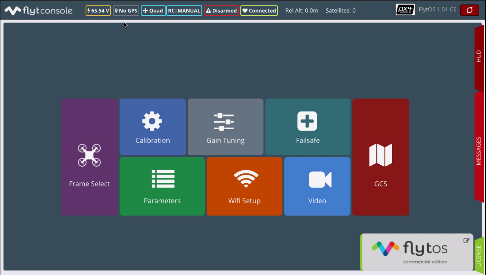

## Frame Select


Frame Select allows you to select the airframe-type of your drone. You are provided with several predefined options of multi-copter and fixed wing configurations. These configurations are further subdivided based on the make of the drone.

Depending upon the actual frame of your drone, select the airframe and click on **Save and Reboot**.

## Calibration

This widget shows you options to calibrate your sensors, ESCs and RC, test your motors and configure RC modes.

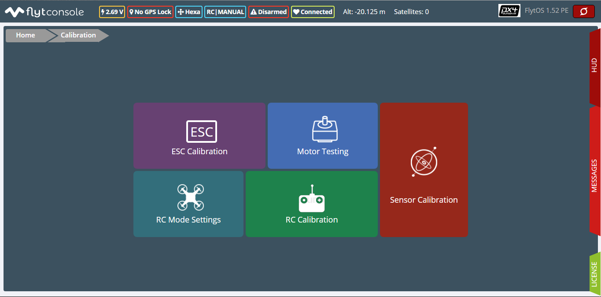

### ESC Calibration

ESC Calibration requires the following fields to be filled:

1. Min PWM Value
2. Max PWM Value
3. Number of Actuators

The Min and the Max PWM values set the range of the expected values from AUTOPILOT to the ESCs. Any value received from the RC beyond this range is converted to the min or max value. Number of actuators is the number of motors depending upon the airframe selected by you in Frame Select. FlytConsole consists of some predefined default values that can be changed.

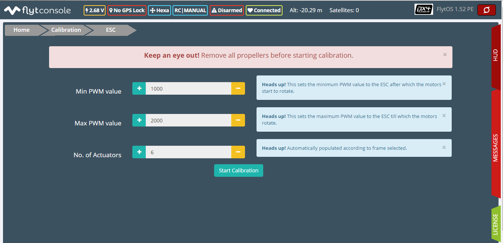

Once you have set the `Min PWM values , Max PWM values and Number of Actuators` click on **Start Calibration**. You will see a message saying `Calibration started`. This marks the start of Stage 1 of ESC Calibration. Disconnect the power from the ESCs and click on **Next**.

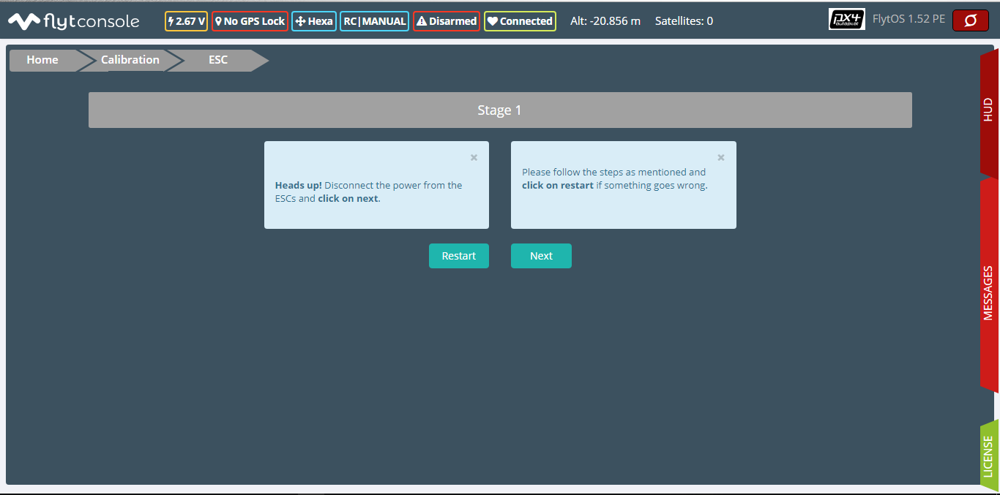

Stage 2 involves setting the time duration\(in seconds\) for the PWM high time in stage 3. After this connect the power to the ESCs and click on **Next**.

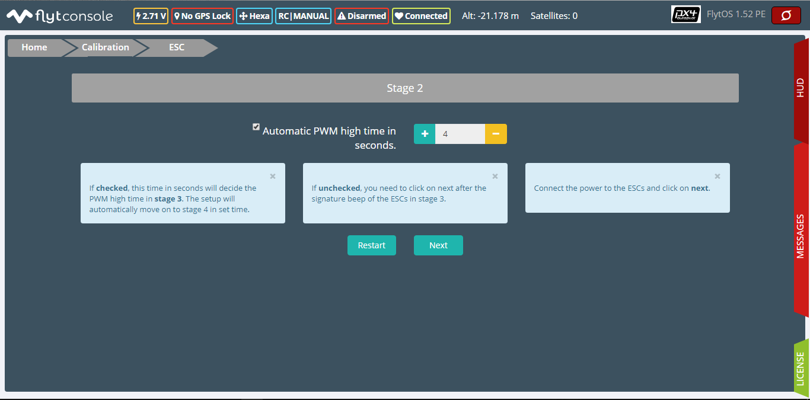


After the time out the ESCs will automatically receive low PWM value. This is stage 3.You can enter this stage manually by disabling the Automatic PWM high time in seconds and click on **Next**.

Stage 4 marks the end of ESC Calibration. Click on **Finish**.



**Important:** 

* Not all ESC’s need range calibration. Please consult your ESC user documentation before you do it.
* Also this is a one-time setup which is NOT required to be done again until you change one or more of your ESC’s.
* It is recommended that you use the default values for minimum and maximum PWM values and the default number of Actuators.


### Motor Testing


FlytConsole allows you to test if the motors are correctly connected. In Motor testing, you can do this by clicking on the respective motor that you want to test. Once you click on the motor, it will start rotating and you can check whether the direction of rotation of the corresponding motor on your drone is correct or not.

There is also a provision for setting the time of rotation for the motors.


Important: 

* You need to power the ESCs for this.
* In case your motor rotates in the incorrect direction, you can swap any two of the ESC cables going to the motor and make the motor rotate in the desired direction.
* If the incorrect motor is rotating, switch PWM output wires going to the ESCs from the controller to the right channel.
* If none of the motors rotate, check the connections again.


### Sensor Calibration


Sensor calibration is of utmost importance before you fly your drone. Set the `AUTOPILOT ORIENTATION` & `EXTERNAL MAG ORIENTATION` if the orientation of the frame and AUTOPILOT are different. The sensors to be calibrated for correct attitude are given below:

#### **Accelerometer Calibration**

Click on **Accel Calibration** to begin.

Hold the drone steady in all the six directions\( x, -x, y, -y, z, -z\) for sometime. You will be notified when the current orientation is detected and when calibration begins for that orientation. Keep steady till you are notified to change to a new direction.

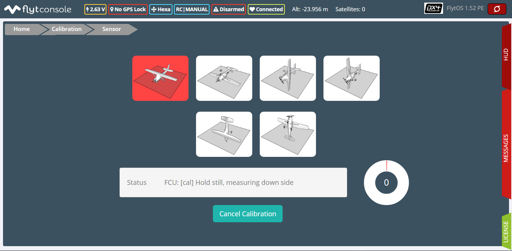

#### **Gyroscope Calibration**

Click on **Gyro Calibration** to begin.

Keep the drone steady without movement in a single state till the calibration ends. You will be notified when the calibration ends.


#### **Magnetometer Calibration**

Click on **Mag Calibration** to begin.

You need to calibrate magnetometer every time you change the flying field. If your autopilot orientation is not the same as that of your drone, update `AUTOPILOT ORIENTATION` parameter accordingly.


#### **Level calibration**

Click on **Level calibration** to begin.

Keep the drone steady in flat position on a leveled surface on the floor.


### RC Calibration


Connect the Throttle, Roll, Pitch and Yaw to the respective RC channels. Also, set the Threshold for two way manual override and three way RC mode switches and their channels.

Once you click on **Start** you are told to lower the throttle switch all the way down and reset all the transmitter trims to center. After this click on **Next**.

Following is a list of pin positions for the next few steps:

* Throttle up position
* Throttle down position
* Yaw right position
* Yaw left position
* Pitch up position
* Pitch down position
* Pitch brought to center
* Switches min and max values
* Switch/Pot/Pin for flags
* Flag up position


**Note:** Hold in these positions for a few seconds till you get a message feedback.


### RC Mode Settings

Map the RC mode switch to a three way switch channel and manual override function to a two way switch channel. Set their respective thresholds.


**Important:** 

* FlytOS can be used without RC, but we recommend having an emergency RC pilot ready in case something goes wrong.
* You need a minimum six channel radio to use with FlytOS.
* Four channels for roll, pitch, yaw and throttle.
* A three way switch for testing with RC modes.
* A two way switch for Manual override.
* A two way optional switch for Return to Launch mode.
* Please follow the instructions in FlytConsole.


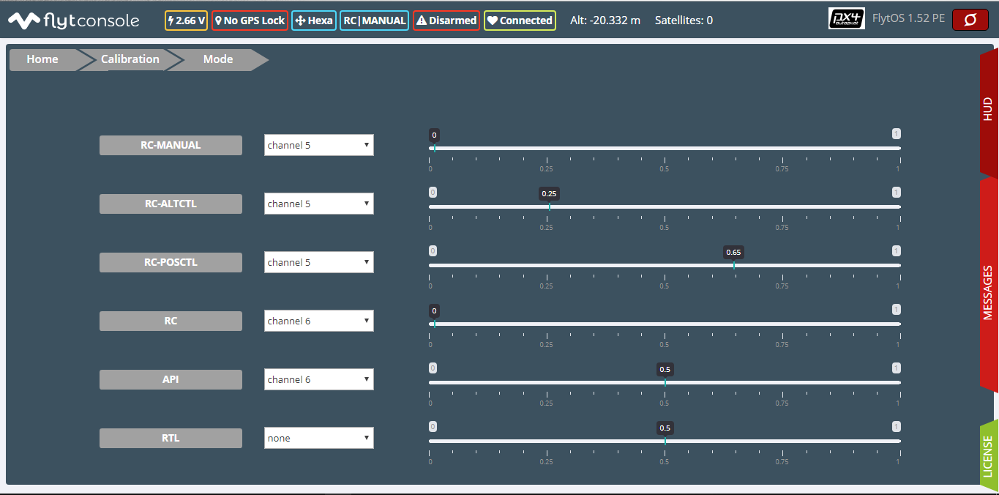

## Gain Tuning

These are the gains that are mostly used and are required to be tuned depending upon the stability of the drone’s autopilot.

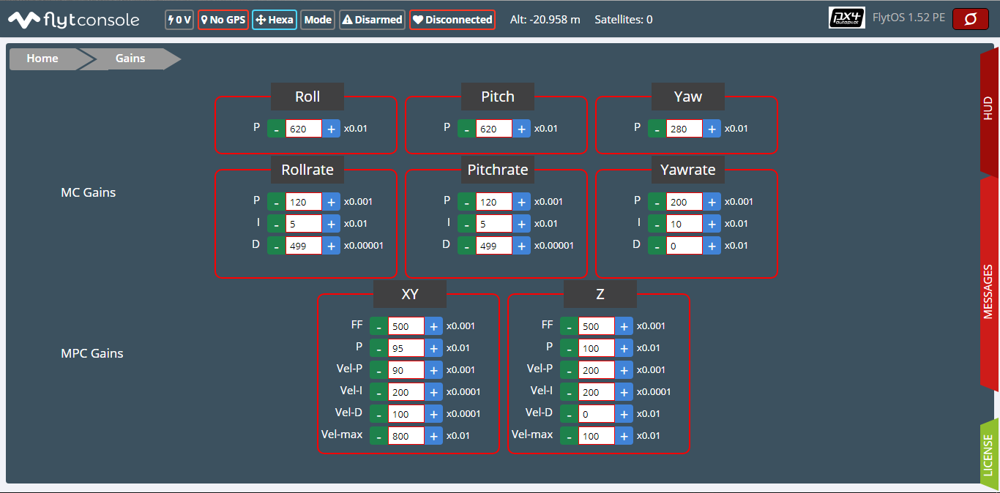

The outer loop of orientation is controlled by the following parameters:

* Roll control \(MC\_ROLL\_P\)
* Pitch control \(MC\_PITCH\_P\)
* Yaw control \(MC\_YAW\_P\)

Inner loop of orientation had the following PID controllers:

* Roll rate control \(MC\_ROLLRATE\_P, MC\_ROLLRATE\_I, MC\_ROLLRATE\_D\)
* Pitch rate control \(MC\_PITCHRATE\_P, MC\_PITCHRATE\_I, MC\_PITCHRATE\_D\)
* Yaw rate control \(MC\_YAWRATE\_P, MC\_YAWRATE\_I, MC\_YAWRATE\_D\)

Begin with MC gain tuning. Once your drone is capable of stable manual flight, you can move on to MPC gain tuning to accomplish more accurate altitude and position control.


**Note:** The following instructions stand for symmetric drones. If the drone is asymmetric then pitch and roll have to be tuned differently.


### MC gains

**Parameters: MC\_ROLLRATE\_P, MC\_PITCHRATE\_P - P Gains**

For a symmetrical drone the Pitch and Roll values can be same, if the drone is sluggish increase the P gain until it starts oscillating. If the P gain is too high there will be oscillations in that axis, so reduce it until it disappears.

**Parameters: MC\_ROLLRATE\_D, MC\_PITCHRATE\_D - D Gains**

After RATE\_P tuning there will be oscillations. Increase the RATE\_D until the oscillations disappears. In case the RATE\_D is too high the oscillations might still be there. In that case reduce RATE\_D slightly.

**Parameters: MC\_PITCH\_P, MC\_ROLL\_P**

If there are oscillations tune down P. Increase P if the copter is sluggish.

**Parameters: MC\_ROLLRATE\_I, MC\_PITCHRATE\_I - I Gains**

If the roll and pitch rates never reach the setpoint but have an offset, add MC\_ROLLRATE\_I and MC\_PITCHRATE\_I gains, starting at 5-10% of the MC\_ROLLRATE\_P gain value.

**Parameters: MC\_YAWRATE\_P - Yaw Rate**

This parameter is not critical and can be tuned in flight, in the worst case scenario the yaw response will be sluggish or too fast. Play with FF parameter to get comfortable response.

**Parameters: MC\_YAW\_P - Yaw Angle**

Rotate it around yaw, and observe the response. It should go back slowly to the initial heading. If it oscillates, tune down P. Once the control response is slow but correct, increase P until the response is firm, but it does not oscillate.

**Parameters: MC\_YAW\_FF - Feed forward tuning**

Feed forward weight for manual yaw control. 0 will give slow response and no overshot, 1 - fast response and big overshot.

**Parameters:MC\_Pitch TC**

Decrease to make pitch control faster and accurate. Increase the value if its twitchy.

**Parameters: MC\_Roll TC**

Decrease to make roll control faster and accurate. Increase the value if its twitchy.

**Parameters: MC\_THR\_HOVER**

Adjust the throttle to hover the copter in the mid-air. Decrease this value if the hover position is less than the throttle center. Increase the value if the hover is more than throttle center.

After your drone is flying properly in manual mode without oscillations, you can start tuning the MPC gains.

### MPC gains

**Parameters: MPC\_XY\_FF**

Reduce the value to make position control smoother and less twitchy. Increase it for more accurate and aggressive position control.

**Parameters: MPC\_Z\_FF**

Reduce the value to make altitude control smoother and less twitchy. Increase it for more accurate and aggressive altitude control.

To learn more about gain tuning click [here](http://px4.io/docs/multicopter-pid-tuning-guide/).

Click here to see the complete parameter [list](https://pixhawk.org/firmware/parameters).

## Parameter Manager

These are all parameters used throughout FlytOS. These can be changed if needed.

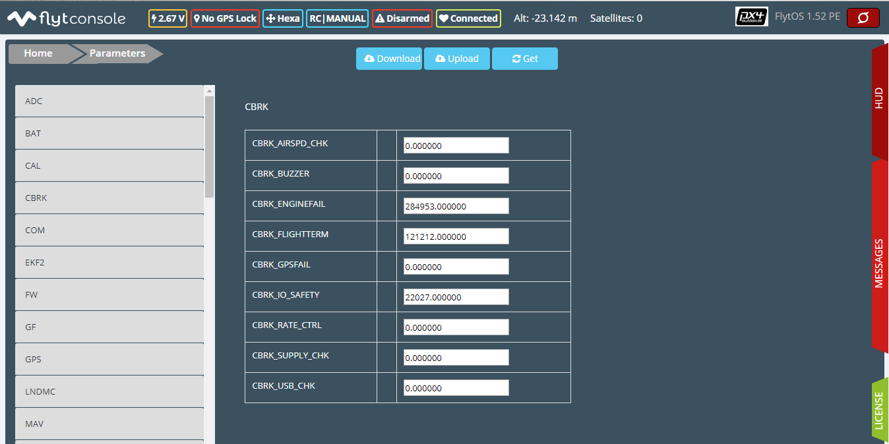

Once this is done, save the parameters.

## Fail Safe

Fail Safe allows you to assign certain Failsafe actions to be performed by the drone during critical situations viz. Low battery, RC loss, Datalink loss, Geofence, Return Home settings and Land settings.

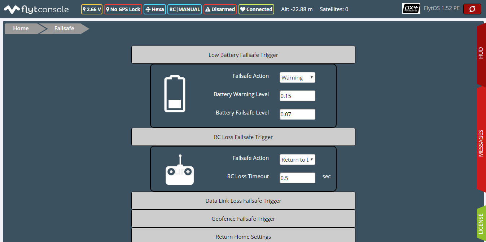

## Video

Video displays the live stream of video directly being captured by the camera on the drone.

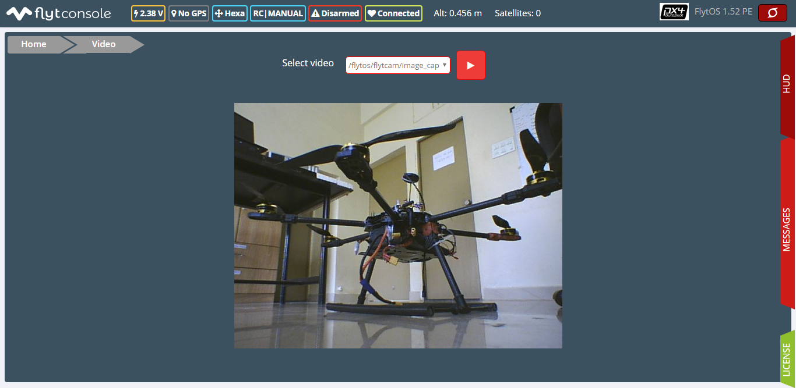

## GCS

After completing all the above mentioned settings you are now ready to fly and test the basic navigation capabilities provided by the GCS.


The functionality of GCS can be divided into three parts:

**Set mission for your drone**

1. Get Waypoints - shows you the current mission.
2. Set Waypoints - allows you to set a new list of waypoints for your drone.
3. Clear - will clear the waypoints.
4. Execute - will make the drone execute the set mission.
5. Pause - will make the drone hover in its current position and not proceed until the mission is executed/resumed again.

**Basic Functions for commanding the drone**

1. TAKE OFF - arms the drone and makes it hover at a height.
2. LAND - commands the drone to land.
3. HOVER - makes the drone hover at its current location.

**Flyt Inspector**

Flyt Inspector streams live data from the drone.

Following data is streamed from the drone:

1. Battery - gives the voltage and current consumed by the System.
2. GPS - gives the current latitude, longitude and altitude of the drone.
3. IMU - gives the current attitude with respect to NED.
4. Local Position - gives the position of the drone with respect to the home position.
5. RC IN - gives the input value received by AUTOPILOT because of RC.

You have now finished configuration. Please go through the [First flight](../flytos/getting-started/first-flight.md) sections before you proceed with flying your drone and make sure you understand all the [Safety guidelines](../flytos/getting-started/first-flight.md#safety-guidelines).

