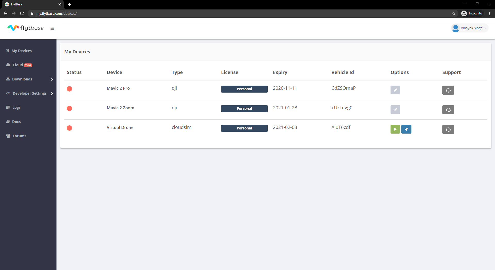
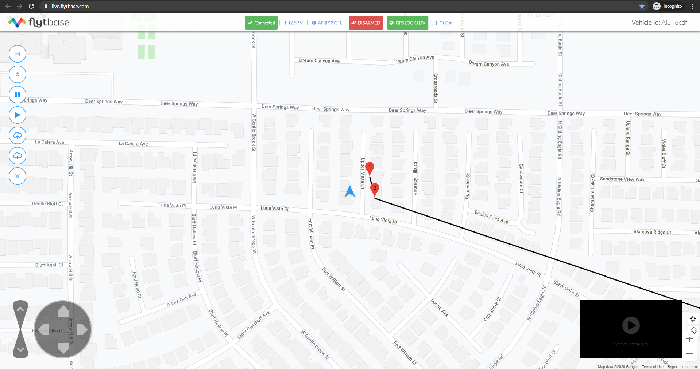

# Cloud Simulator



One click access to simulator instance for drone developers. Test applications in a safe and secure environment, resolve issues and accelerate your development process.

To test Cloud API on the Cloud Simulator, follow the steps given in [Setup](setup.md). When you are enabling access to Vehicles, enable it for the Cloud Sim device, and note that device’s Vehicle ID.

And use the Cloud Simulator’s Vehicle ID as the Vehicle ID to control it using the Cloud APIs.

To run Cloud Sim device and see the results, go to the ‘**My Devices’** tab, and press the Start button to start the device.

Wait for the Cloud Sim device to start and load, once that is done, press the launch console button to launch the FlytConsole for the Cloud Sim device.

The cloud sim device is up and running. Use the FlytConsole cloud app to monitor, command the virtual drone. This app supports mission, basic navigation commands, HUD and basic telemetry. When the actual drone connects to FlytBase cloud this same app can be used to control and monitor the drone from anywhere in the world. Follow the local laws and regulations.

FlytBase APIs for you virtual drone can be used to write cloud, web, mobile apps. Use the vehicle ID and API key of the virtual drone for testing and replace it with actual drone for deployment. Happy coding!

