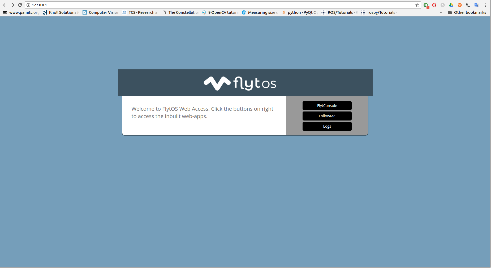

# Setup

### 1. Request Beta Access to Cloud APIs

Go to[ my.flytbase.com/cloud](https://my.flytbase.com/cloud/) and press request access to cloud API. Fill the form, and our support team will contact you as soon as possible.  

### 2. Get Access Token

 Once you get a confirmation from the support team, a new ‘Developer Settings’ tab will appear on your [my.flytbase.com](https://my.flytbase.com/) page.

Once you get the ‘Developer Settings’ tab, you can open it to get your personal access token. Copy this API token ID. Do not share the token ID with any third party unless you trust them. As of the current cloud API release API token key and vehicle ID combined together grant access to all APIs, including navigation.

Press the edit button to manage the devices which can be accessed over the cloud. Unchecked devices won’t be accessible through cloud APIs.

Enable the access status of the devices for which you want to enable the Cloud access. You can change your settings later from developer settings tab.


 **Note:** It is recommended to first test the Cloud APIs on the [Cloud Simulator](cloud-simulator.md) device before actual drone. Proceed further to enable and use cloud APIs for actual drone.


### 3. Enable Cloud Client on drone

To use cloud APIs the companion computer has to be connected to Internet over a 3G/4G/LTE or WiFi connection. Before proceeding further make sure that companion computer is connected to Internet.

FlytOS comes with in-built client software that runs on companion computer and connects with cloud. For user privacy and security this client is disabled by default. To enable the cloud APIs for companion computer start FlytOS and open FlytConsole.

Press the settings button, as shown in the image

Check the cloud client check box to enable cloud APIs.


**Note:** Cloud APIs will be enabled after you restart your device


### 4. Ready to Test

To try out the FlytConsole cloud app go to [my.flytbase.com](https://my.flytbase.com/), devices tab. In front of the particular device click on launch console button to launch the app. This app can be used to control, monitor the drone from anywhere in the world. Follow the local rules and regulations.

Refer to [api.flytbase.com](http://api.flytbase.com/) JS-Rest/JS-WebSocket section to learn how to make the rest/websocket requests to the Cloud API using JavaScript.


**Note:**  You’ll need to replace &lt;ip&gt; with [https://dev.flytbase.com/rest](https://dev.flytbase.com/rest) for rest call, and [https://dev.flytbase.com/websocket](https://dev.flytbase.com/websocket) for websocket calls.


An example of the rest calls using Python are available on the [GitHub](https://github.com/flytbase/flytsamples).

To run the example, [install Python 2.7](https://www.python.org/downloads/) on your computer, [install pip](https://packaging.python.org/tutorials/installing-packages/) and [install requests for python](http://docs.python-requests.org/en/master/user/install/) using your terminal or command prompt.

Then download the [flytsamples repository](https://github.com/flytbase/flytsamples), open folder Cloud-Client, and open the file cloud\_client\_rest.py.

Replace the variable ‘token’ with your Personal Access Token and the variable ‘VehicleID’ with the VehicleID of the device you want to control. Do not forget to place the Token and VehicleID within single inverted commas.


**Note:**  Some APIs do not work for all devices, check [api.flytbase.com](http://api.flytbase.com/) to check if your device supports a specific API



**Note:** APIs which will result in the movement of vehicle have been commented out in the sample python file, so that the vehicle doesn’t run into trouble because of arbitrary values. You can uncomment and try them yourselves, be careful of what values you pass with them.


