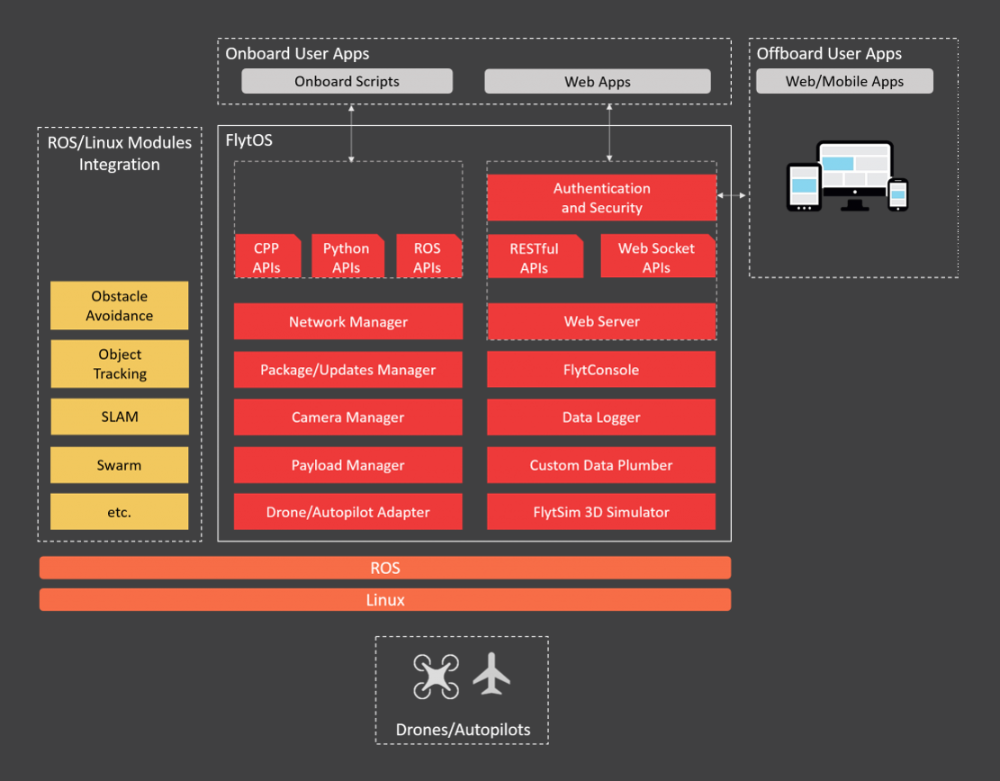

# Introduction



FlytOS is the software framework of FlytBase. It is based on Linux and ROS \(Robot Operating System\) making it an ideal platform for research and commercial drone applications. It can interact with any compatible drone/autopilot using its adapter layer and exposes high level FlytAPIs in ROS, C++, Python, REST and Web-socket. It makes it easy to integrate custom payload and also provides advanced APIs using its onboard modules. These rich set of APIs allow for easy development of onboard business logic as well as remote monitoring and control through web and mobile apps. The modular design of FlytOS allows for integration with external ROS/Linux libraries and custom data plumbing between onboard and off-board apps.

FlytOS is available for download and install on a Linux/ROS based computer. This setup allows for integration with any compatible drone/autopilot.

The apps developed with FlytAPIs can talk to compatible drone/autopilot and can also be tested in a virtual ROS/Gazebo environment using FlytSim. The vision of FlytOS is to provide a standard language for the drone developers to talk to their drones.



## Start / Stop FlytOS

**Start/Stop FlytOS on boot**

* If you have installed FlytOS correctly, FlytOS will start automatically on every boot-up.
* On boot-up FlytOS will also check for any updates. Available updates will be downloaded and installed automatically.
* You can find more information on FlytOS automatic updates [here](../getting-started/flytos-updates.md).

**Start/Stop FlytOS from command line**

* Launch FlytOS  


  You can also launch FlytOS in a terminal to see debug messages at startup. Open a **new** terminal and run this command.

  ```text
  $ launch_flytOS
  ```


 **Important:** If you get this error: `Error: package 'core_api' not found`, source your /etc/bash.bashrc `file.`


* Kill FlytOS  
  
  To kill this instance of FlytOS, run this command in your terminal.

  ```text
  $ launch_flytOS
  ```

