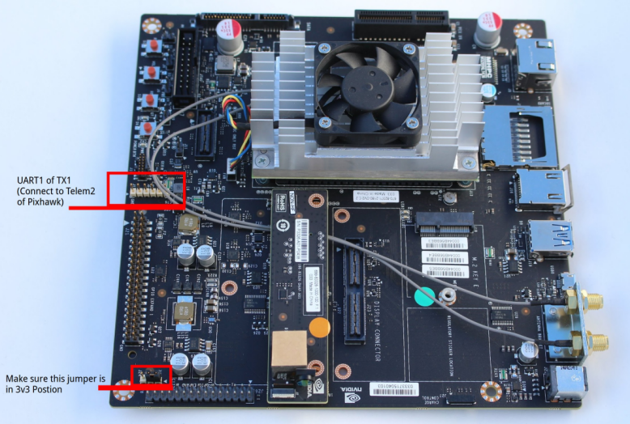
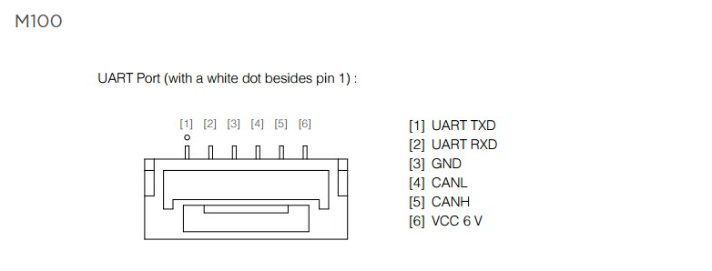
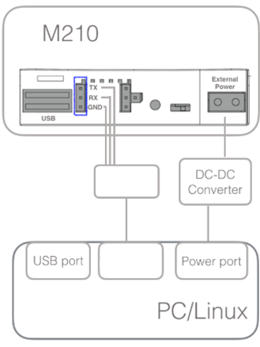
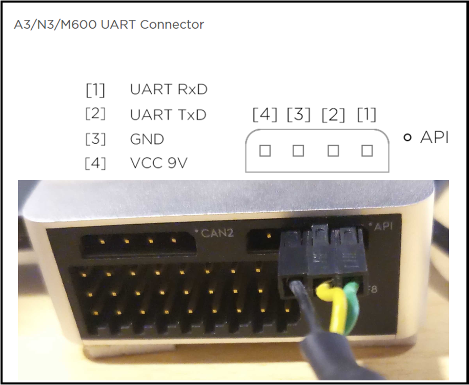
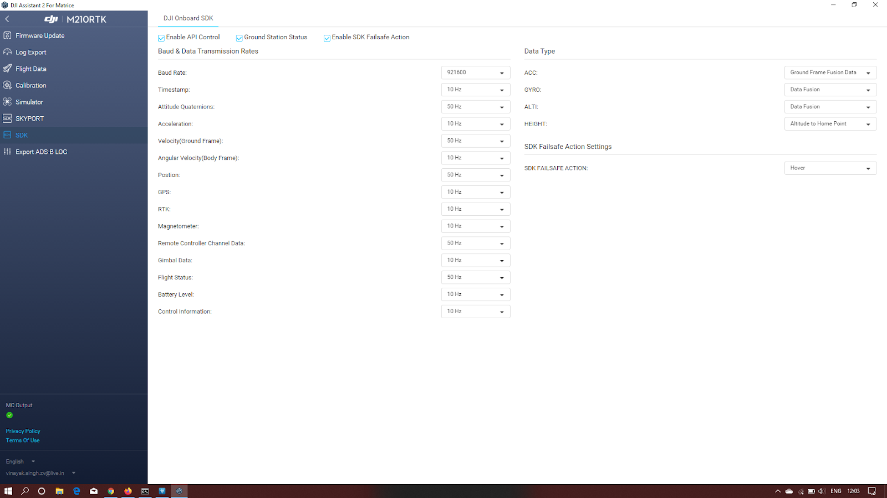

# Nvidia TX1/TX2

## Installing FlytOS

* Please ensure you are running Linux - Ubuntu 16.04 before proceeding with installation. This guide assumes you already have a working operating system on your Flight Computer. The following commands should be executed on your flight computer, you may either use an external display or ssh into your flight computer.


**Warning:** Please make sure you have a stable internet connection. Save and close all open applications before executing the script as your system shall reboot on installation.


* Open terminal and run the following command

```text
$ sudo sh -c 'curl -sSL https://downloads.flytbase.com/flytos/install/flytOS.sh | bash'
```

In case you get an error saying curl: command not found, please run the following command

```text
$ sudo sh -c 'wget -O - https://downloads.flytbase.com/flytos/install/flytOS.sh | bash'
```

* Please enter your system password when prompted
* On successful installation you will get the message **Congratulations! FlytOS installation completed** and your system shall reboot.

## Troubleshooting

* If the installation script throws an error, please reboot and try again.
* If you get the error “Connection Timed Out”: Please check your internet connection and run the script again.
* If the script is interrupted during execution, try running the following command before you execute the script again

  ```text
  $ sudo dpkg --configure -a
  ```

* If the above command does not work, run the following to fix your packages before running the installation script

  ```text
  $ sudo apt-get upgrade --fix-broken
  ```

## WiFi Setup

* To access internet on your TX1/TX2 \(for activation, loading maps, auto updates, etc\), you can connect the WiFi on TX1/TX2 to your home’s WiFi router that has access to internet.
* If you want to create a WiFi hotspot on the TX1/TX2, follow the steps given in [this post](https://devtalk.nvidia.com/default/topic/910608/jetson-tx1/setting-up-wifi-access-point-on-tx1/post/4893879/#4893879)

## Activate FlytOS


**Note:** This step requires you to have a registered FlytBase Account. In case you don’t have an account, [create a FlytBase Account](../create-flytbase-account.md) before you proceed.


You have to activate installed FlytOS, without which critical APIs would not function.

* Make sure your TX1/TX2 has internet access before proceeding.
* [Launch FlytConsole](../../../flytcloud/about-flytbase-cloud.md). You can launch FlytConsole in the TX1’s browser using the URL `http://localhost/flytconsole` or on your PC’s browser using the URL `http://ip-address-of-device/flytconsole` .
* In FlytConsole click on **Activate Now tag** under **License tab** at bottom right corner. A pop-up will appear which will direct you to the device registration page. If you are not logged in, enter your FlytBase Account credentials to log in.
* Choose a device nick-name and select your compute engine.
* In the license drop-down list, select existing license if available or select ‘Issue a new license’. You can also provide a nick-name for your license.
* Choose commercial license if you have purchased a commercial license and have the commercial license code or select the personal license.
* Click on Save Changes to register device and generate a license key.
* Copy the generated license key and enter it in FlytConsole to complete the activation process of your device. The Activate Now tag at bottom right corner of FlytConsole should now turn green.

## Hardware Setup for Pixhawk

### Pixhawk Telemetry Connection

Connect the TELEM2 port of Pixhawk autopilot to UART1 port of TX1/TX2. If you are using the TX1/TX2 developer kit carrier board , then the UART1 can be found on the J17 connector. Visit [this link](https://developer.nvidia.com/embedded/dlc/jetson-tx1-developer-kit-carrier-board-spec) \(Page 28 Section 3.7\) to view the pin-out of TX1’s J17 connector.



### Configuring Pixhawk Autopilot



* Install [QGC\(QGroundControl\)](http://qgroundcontrol.com/) on your local machine.
* Connect Pixhawk to QGC using the USB port at the side of Pixhawk.
* Install the latest stable APM release in Pixhawk using QGC by following [this](https://donlakeflyer.gitbooks.io/qgroundcontrol-user-guide/content/SetupView/Firmware.html) guide.
* Once done, visit [parameter widget in QGC](https://donlakeflyer.gitbooks.io/qgroundcontrol-user-guide/content/SetupView/Parameters.html) and search for parameters **SERIAL2\_BAUD** and **SERIAL2\_PROTOCOL**, set them to **921** and **1** respectively. This would enable communication between FlytOS running on Raspberry Pi 3 and Pixhawk.
* Configure a dedicated switch position for `GUIDED MODE` during RC calibration, to allow FlytOS to take control of drone from RC when vehicle is switched to `GUIDED MODE`.



* Install [QGC\(QGroundControl\)](http://qgroundcontrol.com/) on your local machine.
* Connect Pixhawk to QGC using the USB port at the side of Pixhawk.
* Install the latest stable PX4 release in Pixhawk using QGC by following [this](https://donlakeflyer.gitbooks.io/qgroundcontrol-user-guide/content/SetupView/Firmware.html) guide.
* Once done, visit [parameter widget in QGC](https://donlakeflyer.gitbooks.io/qgroundcontrol-user-guide/content/SetupView/Parameters.html) and search for parameter **SYS\_COMPANION** and set it to 921600. This would enable communication between FlytOS running on Raspberry Pi 3 and Pixhawk.
* Configure a dedicated two way switch for `OFFBOARD MODE` during RC calibration, to allow FlytOS to take control of drone from RC when vehicle is switched to `OFFBOARD MODE`.



## Hardware Setup For DJI

### DJI Telemetry Connection



Connect the UART RX and TX pins of your TX1/TX2 to the UART port Tx and Rx pins of your DJI M100 as shown below. Click [here](https://developer.dji.com/onboard-sdk/documentation/development-workflow/hardware-setup.html) for more details.




**Caution:** Do NOT use the Vcc pin to power your own devices. You might damage your onboard computer.




Connect the UART RX and TX pins of your TX1/TX2 to the API port Tx and Rx pins of your DJI M210 as shown below. Click [here](https://developer.dji.com/onboard-sdk/documentation/development-workflow/hardware-setup.html) for more details.




**Caution:** Do NOT use the Vcc pin to power your own devices. You might damage your onboard computer.




Connect the UART RX and TX pins of your TX1/TX2 to the API port Tx and Rx pins of your DJI A3 as shown below. Click [here](https://developer.dji.com/onboard-sdk/documentation/development-workflow/hardware-setup.html) for more details.




**Caution:** Do NOT use the Vcc pin to power your own devices. You might damage your onboard computer.




### Configuring DJI Autopilot



* Make sure the API/UART port of M100 is connected to the Companion Computer’s UART port.
* Download [DJI Assistant](https://www.dji.com/downloads/softwares/assistant-dji-2) for DJI M100 on your Local Machine 
* Connect DJI M100 to Local Machine via USB Cable
* Verify M100 is running the latest firmware. Check [this](https://github.com/dji-sdk/Onboard-SDK#firmware-compatibility) link for the same.
* Launch DJI Assistant, go to SDK tab and enable the following check boxes: **Enable API control**, **Ground Station status**, **Enable SDK Failsafe Action**. Also, configure **baud rate to 230400** & **SDK Failsafe Action to Hover**.
* Set other data transmission rates to 10Hz.
* Reboot the M100
* Once rebooted, reconnect M100 with DJI assistant. Make sure the laptop running DJI assistant has an active internet connection.
* Install the DJI Go app on an Android/IOS phone, connect it to M100 RC. Make sure the phone is connected to the internet.
* Enable Multiple/intelligent flight mode from DJI GO4 App, to allow FlytOS to take control of drone from RC when the vehicle is switched to P-Mode or F-Mode


**Caution:** To take manual control of drone from RC, switch the RC Mode to P-Mode for DJI M100




* Make sure the API/UART port of autopilot is connected to the Companion Computer’s UART port.
* Download [DJI Assistant](https://www.dji.com/downloads/softwares/assistant-dji-2-for-matrice) for DJI M210 on your Local Machine.
* Connect DJI autopilot to Local Machine via USB Cable
* Verify autopilot is running the latest firmware. Check [this](https://github.com/dji-sdk/Onboard-SDK#firmware-compatibility) link for the same.
* Launch DJI Assistant, go to SDK tab and enable the following check boxes: **Enable API control**, **Ground Station status**, **Enable SDK Failsafe Action**. Also, configure **baud rate to 921600** & **SDK Failsafe Action to Hover**.
* Set other data transmission rates as shown in the screenshot



* Reboot the drone/autopilot
* Once rebooted, reconnect the drone/autopilot with DJI assistant. Make sure the laptop running DJI assistant has an active internet connection.
* Install the DJI Go app on an Android/IOS phone, connect it to autopilot for drone's RC. Make sure the phone is connected to the internet.
* Enable Multiple/intelligent flight mode from DJI GO4 App, to allow FlytOS to take control of drone from RC when the vehicle is switched to P-Mode or F-Mode


**Caution:** To take manual control of drone from RC, switch the RC Mode to S-Mode or A-Mode




* Make sure the API/UART port of autopilot is connected to the Companion Computer’s UART port.
* Download [DJI Assistant](https://www.dji.com/downloads/softwares/assistant-dji-2-for-matrice) for DJI A3/M600 on your Local Machine.
* Connect DJI autopilot to Local Machine via USB Cable
* Verify autopilot is running the latest firmware. Check [this](https://github.com/dji-sdk/Onboard-SDK#firmware-compatibility) link for the same.
* Launch DJI Assistant, go to SDK tab and enable the following check boxes: **Enable API control**, **Ground Station status**, **Enable SDK Failsafe Action**. Also, configure **baud rate to 921600** & **SDK Failsafe Action to Hover**.
* Set other data transmission rates as shown in the screenshot.


* Reboot the drone/autopilot
* Once rebooted, reconnect the drone/autopilot with DJI assistant. Make sure the laptop running DJI assistant has an active internet connection.
* Install the DJI Go app on an Android/IOS phone, connect it to autopilot for drone's RC. Make sure the phone is connected to the internet.
* Enable Multiple/intelligent flight mode from DJI GO4 App, to allow FlytOS to take control of drone from RC when the vehicle is switched to P-Mode or F-Mode


**Caution:** To take manual control of drone from RC, switch the RC Mode to S-Mode or A-Mode




## **Now Let's move on to the Next step:**




