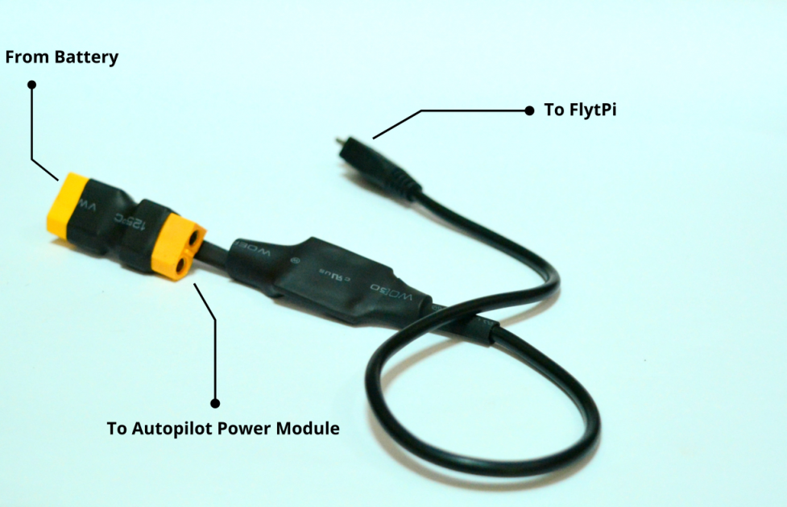

# Getting Started with FlytPi

## Contents

* 1x Raspberry Pi3 Model B
* 1x Plastic Enclosure
* 1x 32GB uSD Card Class 10 with FlytOS Commercial Edition
* 1x Attached UART-to-UART cable
* 1x Power Module 5V 4A \(Powers FlytPi, provides battery out for Autopilot and ESCs\)
* 1x Wall Adapter \(Micro-USB\)
* 1x HDMI Cable
* 1x Ethernet Cable


**Note:** The FlytPi comes preactivated with a FlytOS commercial licence right out of the box.


## Integrating FlytPi with your Drone

### Prerequisites

* Drone with compatible autopilot \(Pixhawk/Pixhawk2.1 Cube/Pixhawk Mini\).
* Drone should be able to do position hold with GPS.
* Offboard mode configured on a dedicated two way RC switch.
* Battery 2s-6s with XT60 output connector.
* Configure autopilot for companion computer as given below.

### Configuring Pixhawk Autopilot



* Install [QGC\(QGroundControl\)](http://qgroundcontrol.com/) on your local machine.
* Connect Pixhawk to QGC using the USB port at the side of Pixhawk.
* Install the latest stable APM release in Pixhawk using QGC by following [this](https://donlakeflyer.gitbooks.io/qgroundcontrol-user-guide/content/SetupView/Firmware.html) guide.
* Once done, visit [parameter widget in QGC](https://donlakeflyer.gitbooks.io/qgroundcontrol-user-guide/content/SetupView/Parameters.html) and search for parameters SERIAL2\_BAUD and SERIAL2\_PROTOCOL, set them to 921 and 1 respectively. This would enable communication between FlytOS running on FlytPi and Pixhawk.
* Configure a dedicated switch position for `GUIDED MODE` during RC calibration, to allow FlytOS to take control of drone from RC when vehicle is switched to `GUIDED MODE`.



* Install [QGC\(QGroundControl\)](http://qgroundcontrol.com/) on your local machine.
* Connect Pixhawk to QGC using the USB port at the side of Pixhawk.
* Install the latest stable PX4 release in Pixhawk using QGC by following [this](https://donlakeflyer.gitbooks.io/qgroundcontrol-user-guide/content/SetupView/Firmware.html) guide.
* Once done, visit [parameter widget in QGC](https://donlakeflyer.gitbooks.io/qgroundcontrol-user-guide/content/SetupView/Parameters.html) and search for parameter SYS\_COMPANION and set it to 921600. This would enable communication between FlytOS running on FlytPi and Pixhawk.
* Configure a dedicated two way switch for `OFFBOARD MODE` during RC calibration, to allow FlytOS to take control of drone from RC when vehicle is switched to `OFFBOARD MODE`.



### Setup the FlytPi on your Drone

* Mount the FlytPi on drone at convenient spot.
* Connect the UART connector of your FlytPi to the TELEM 2 port of Pixhawk/Pixhawk2.1 Cube/Pixhawk Mini.
* Mount power module on the drone.
* Connect micro USB connector of power module to the FlytPi power input connector.
* Connect Female XT60 connector of the power module to power module for Pixhawk.


**Note:** Power module for FlytPi does not power up the Pixhawk.


* Connect male XT60 connector to the battery.
* Wait for the FlytPi to boot up. This may take about a minute.
* FlytPi creates a WiFi access point on boot up. Connect your device to the FlytPi WiFi network with following credentials.**SSID: flytos\_WiFiPassword: flytos123**
* Open the browser on your device and navigate to [http://10.42.0.1/flytconsole](http://10.42.0.1/flytconsole).
* Once FlytConsole loads, you can see that your device is activated with a commercial license. Open GCS and see that the HUD at the top right corner is responsive.


**Note:** \(Optional\) If you want to use a screen, connect a HDMI cable from the FlytPi to a monitor. This step is optional as you can also use FlytPi in headless mode \(without a monitor\).


## Now you can get your drone ready for [First Flight](../flytos/getting-started/first-flight.md)

