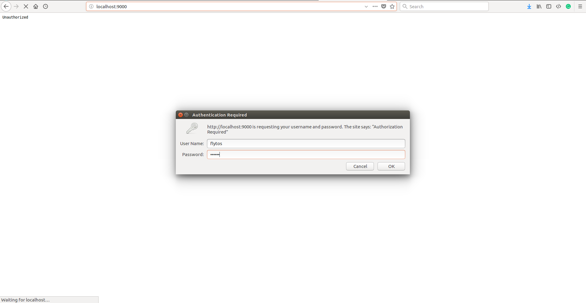

# Basics

## Directory Structure

The repository is divided into 3 directories depending upon the host OS you choose to use. _Linux_ is further divided into 2 depending upon the GPU driver running on your machine.

Eventually, all the directories have the following scripts:

**setup** : This script as the name suggests sets up your machine to run FlytSim.

**start** : This script launches a FlytSim docker container for you. It also opens up a tab in your browser connecting to [http://localhost/flytconsole](http://localhost/flytconsole). Try waiting for around 30 seconds after triggering this script, before manually opening up the link to FlytConsole. You can use this script to restart FlytSim session as well.

**stop** : As its clear from the name, it stops the FlytSim app and shuts down the docker container, but preserving its environment, which means executing the _start_ script again, would start FlytSim app and resume the container session for you.

**openshell** : This script would launch a bash shell inside the FlytSim container. You can execute this script in parallel, to launch multiple shells inside the FlytSim container.

**reset** : This script resets FlytSim container to factory default settings.

**docker-compose.yml** : This is a yml specification of the docker container. **Please refrain from editing this file, unless you are an expert on Docker.**

## Start FlytSim



Open a new terminal, and go to the directory where this project was unzipped by you. **Get inside corresponding directory according to your OS \(as you might have chosen while FlytSim setup\).** Run this command in your terminal:

```text
$ sudo ./start.sh
```



Go to the directory where this project was unzipped by you. **Get inside Windows directory.** Start your FlytSim session by opening **start.ps1** script with Windows Powershell application.



Open a new terminal, and go to the directory where this project was unzipped by you. **Get inside corresponding directory according to your OS \(as you might have chosen while FlytSim setup\).** Run this command in your terminal:

```text
$ sudo ./start.sh
```



## Stop FlytSim



Open a new terminal, and go to the directory where this project was unzipped by you. **Get inside corresponding directory according to your OS \(as you might have chosen while FlytSim setup\).** Run this command in your terminal:

```text
$ sudo ./stop.sh
```



Go to the directory where this project was unzipped by you. **Get inside Windows directory.** Start your FlytSim session by opening **stop.ps1** script with Windows Powershell application.



Open a new terminal, and go to the directory where this project was unzipped by you. **Get inside corresponding directory according to your OS \(as you might have chosen while FlytSim setup\).** Run this command in your terminal:

```text
$ sudo ./stop.sh
```



## Shell Access



Open a new terminal, and go to the directory where this project was unzipped by you. **Get inside corresponding directory according to your OS \(as you might have chosen while FlytSim setup\).** Run this command in the terminal:

```text
$ ./openshell.sh
```



Go to the directory where this project was unzipped by you. **Get inside Windows directory.** Start your FlytSim session by opening **openshell.ps1** script with Windows Powershell application.



Open a new terminal, and go to the directory where this project was unzipped by you. **Get inside corresponding directory according to your OS \(as you might have chosen while FlytSim setup\).** Run this command in the terminal:

```text
$ ./openshell.sh
```



### Web-IDE Access

With FlytSim-Docker version 1.5-5, we have introduced [Cloud9](https://en.wikipedia.org/wiki/Cloud9_IDE), a web-based IDE which supports multitudes of programming languages. It is recommended to use this tool, if the developer wants to edit/write any code inside FlytSim’s docker instance.

To open the IDE, launch a web browser and go to URL: `http://<ip of your laptop running FlytSim>:9000/`. **Username** and **Password** credentials are **‘flytos’** and **‘flytos’** respectively.



